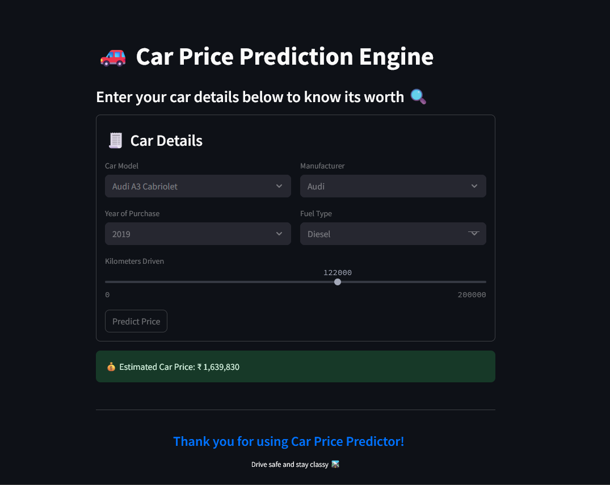

# 🚗 Car Price Prediction Engine

A smart, interactive web app that predicts used car prices based on the car’s key features. Whether you're looking to sell your car or just curious about its market value, this app gives you a solid estimate in seconds.

Built using **Streamlit** and deployed for live access, this project utilizes a machine learning model trained on cleaned car data for real-world prediction.

---

## 🎯 Objective

To accurately predict the resale price of a car based on input features like make, model, fuel type, mileage, and more — all via a clean, no-hassle UI.

---

## 🔧 Features

- 🚘 Predict resale price of cars based on:
  - Car brand & model
  - Year of purchase
  - Fuel type
  - Kilometers driven
  - Manufacturer

- 🧠 Uses regression techniques for precise prediction.
- 💻 Deployed using **Streamlit** for easy user access.
- 📊 Real-time prediction with simple sliders and dropdowns.
- 🌐 Hosted and accessible via web browser.

---

## 🧠 Tech Stack

| Tool | Purpose |
|------|---------|
| **Python** | Core language |
| **Pandas / NumPy** | Data preprocessing & handling |
| **Scikit-learn** | ML model building |
| **Streamlit** | App interface & deployment ||

---

## 🚀 How It Works

1. Data is taken for kaggle.
2. Model trained using regression techniques.
3. User inputs are passed to the model via the Streamlit frontend.
4. Predicted price is instantly shown on the screen.
5. App deployed publicly for anyone to access.

---

## 📸 Demo Preview


---

## 🛠️ How to Run Locally

```bash
git clone https://github.com/your-username/car-price-prediction.git
cd car-price-prediction
pip install -r requirements.txt
streamlit run app.py
